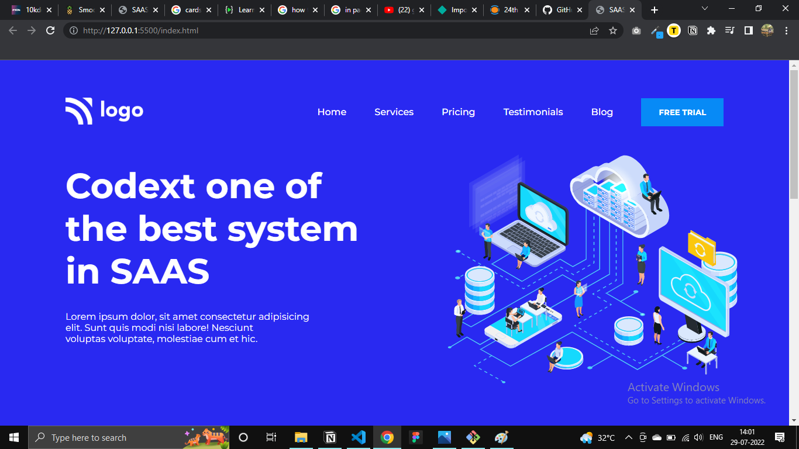
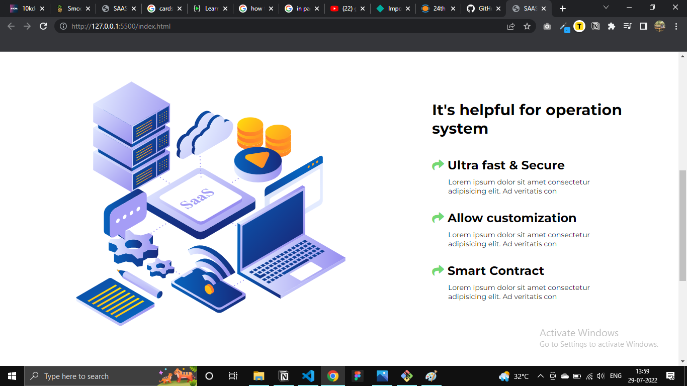
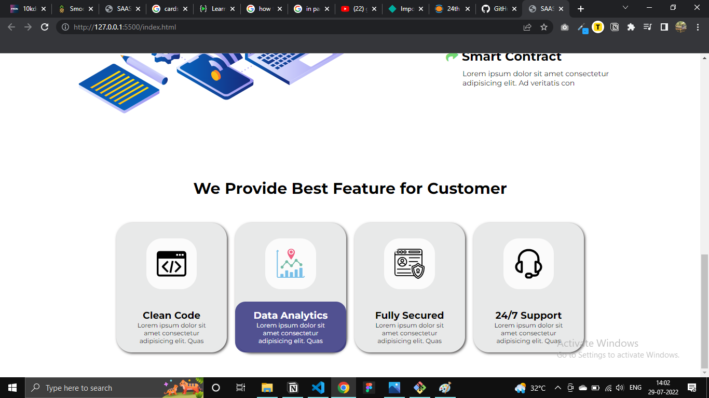

# SAAS Landing Page

### Things I learnt while making this page:
- To position text and images on both sides of the page.
- Marking cards with various components inside it.
- Dealing with margins and paddings, heights.

#### Time Spent: 3 hours

[Live](https://saas-landing-page-vivekn.netlify.app/)

#### Here is the quick look of How webpage will look like

Thanks for vising.

Please give your feedback.

I'm always interested in connecting with like minded people. Let's connect @
[Twitter](https://twitter.com/VivekNakkana)